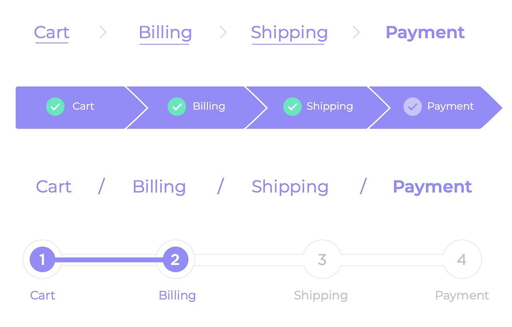

"여기가 어디지?"

복잡한 웹사이트를 탐색하다가 길을 잃어본 경험, 누구나 있을 겁니다. 이때 우리를 구해주는 것이 바로 '브레드크럼(Breadcrumb)'입니다. 홈 > 카테고리 > 상품명처럼 현재 위치를 보여주는 작은 텍스트가 바로 디지털 세상의 나침반 역할을 합니다.

브레드크럼이라는 이름은 그림 형제의 동화 '헨젤과 그레텔'에서 왔습니다. 숲에서 길을 잃지 않기 위해 빵 부스러기를 흘리며 걸었던 이야기처럼, 웹사이트에서도 사용자가 어디서 왔는지 추적할 수 있게 해주는 기능이라는 의미입니다. 1990년대 후반 웹사이트가 복잡해지면서 사용자들이 자신의 위치를 파악하기 어려워하자, UX 디자이너들이 도입한 개념입니다.

아마존은 브레드크럼을 마스터한 대표적인 기업입니다. "홈 > 전자제품 > 컴퓨터 > 노트북 > 삼성 노트북"처럼 상세한 경로를 제공해 사용자가 언제든 원하는 카테고리로 돌아갈 수 있게 합니다. 구글은 검색 결과에서도 브레드크럼을 활용해 웹사이트의 구조를 명확히 보여주며, 이는 SEO에도 도움을 줍니다. 애플은 미니멀한 디자인 철학에 맞춰 간결한 브레드크럼을 사용하되, 꼭 필요한 경로만 보여줍니다.

브레드크럼의 가장 큰 이점은 사용자가 현재 위치를 명확히 알 수 있고, 원하는 상위 카테고리로 쉽게 이동할 수 있다는 것입니다. 이는 이탈률을 줄이고 사이트 내 탐색을 촉진하며, 검색엔진 최적화에도 도움이 됩니다.

브레드크럼을 효과적으로 사용하려면 몇 가지 원칙을 지켜야 합니다. 홈페이지에는 필요 없으며, 3단계 이상의 깊은 구조에서 사용하는 것이 효과적입니다. 각 단계는 클릭 가능하게 만들고, 현재 페이지는 클릭할 수 없게 처리해야 합니다. 시각적으로는 페이지 상단 헤더 아래나 페이지 제목 위에 배치하며, > 또는 / 같은 구분자로 단계를 명확히 표시해야 합니다.

주의할 점은 브레드크럼이 주 내비게이션을 대체해서는 안 되며, 보조적인 역할에 머물러야 한다는 것입니다. 또한 일관성 있는 구조를 유지하고, 사용자가 혼란스럽지 않도록 명확한 라벨을 사용해야 합니다.

브레드크럼은 사용자가 디지털 미로에서 길을 잃지 않도록 도와주는 나침반 역할을 하며, 웹사이트의 사용성과 검색 최적화 모두에 기여합니다. 헨젤과 그레텔의 지혜를 담은 이 작은 기능으로 사용자에게 더 나은 길 안내를 제공해보세요. :-)

UX의 언어들이 책으로 나왔어요.

[**UX의 언어들 | 한성희 | 파지트 - 예스24**

일상 속 UX의 발견UX 세계를 향한 친절한 안내서 『UX의 언어들』은 일상 속에 스며든 UX를 UX 디자이너의 시선으로 풀어내며, 우리가 이를 어떻게 경험하고 소비하는지 넷플릭스, 카카오 등 친숙

https://www.yes24.com/product/goods/193444437](https://www.yes24.com/product/goods/193444437 "https://www.yes24.com/product/goods/193444437")