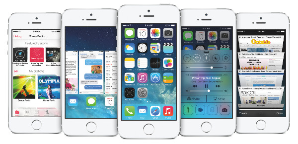
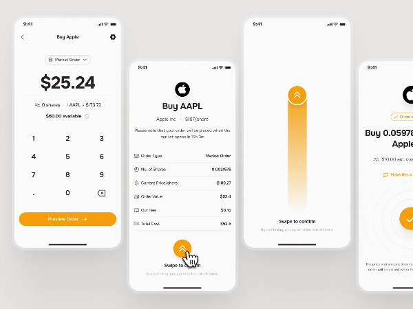
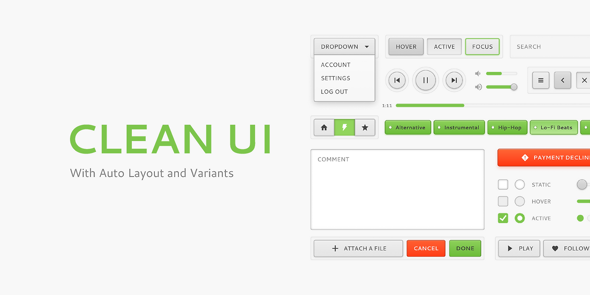

"깔끔한 화면이 최고지!"

누구나 한 번쯤 생각해본 말일 겁니다. 하지만 'Clean UI'가 단순히 보기 좋은 화면 그 이상이라는 사실, 알고 계셨나요? 깨끗한 인터페이스 뒤에 숨겨진 진짜 비밀을 파헤쳐보겠습니다.

2000년대 초, 웹사이트와 앱들은 온갖 버튼, 메뉴, 광고로 가득 차 있었습니다. 이때 등장한 것이 바로 'Clean UI' 불필요한 요소를 걷어내고 사용자가 원하는 핵심 정보와 기능만 남기는 디자인 철학이었습니다.

결정적 순간은 2007년 애플이 첫 아이폰을 공개할 때였습니다. 당시 스마트폰과는 달리 물리적 키를 최소화하고, 터치 인터페이스와 심플한 앱 아이콘만 남긴 파격적 디자인이 전 세계에 충격을 주었습니다. 이후 구글, 에어비앤비, 넷플릭스 등도 이 트렌드를 적극 받아들이면서 글로벌 표준이 되었습니다.

여기서 흥미로운 반전이 있습니다. 글로벌 기업들은 단순히 비우기만 하는 것이 아닌 'Clean UI + Twist' 전략을 사용합니다. 애플은 단순함 속에 다양한 제스처와 숨은 기능을 넣어, 사용자가 '직접 발견'하는 재미를 줍니다. iOS의 '스와이프 제스처'나 '롱프레스' 같은 숨겨진 기능들이 대표적입니다.

구글 검색창은 극도로 단순해 보이지만, 실제로는 엄청난 AI와 추천 기능, 자동완성 등 '보이지 않는 기술'이 숨어 있습니다. 에어비앤비의 숙소 검색화면도 깔끔하지만, 필터나 지도, 날짜 선택 등은 사용자가 필요할 때만 자연스럽게 드러나도록 설계되어 있습니다.

Clean UI가 제공하는 이점은 명확합니다. 사용자가 핵심 정보에만 집중할 수 있어 집중력이 향상되고, 초보자도 쉽게 적응할 수 있어 학습 곡선이 최소화됩니다. 불필요한 클릭과 고민이 줄어들어 작업 속도가 빨라지며, '세련됨'과 '신뢰감'을 통해 브랜드 이미지가 강화됩니다.

실무에서는 꼭 필요한 정보와 기능만 우선 배치하고, 사용자가 필요할 때만 추가 옵션을 보여주는 상황별 UI를 구현하는 것이 좋습니다. 제스처나 롱프레스 같은 '발견의 재미'를 주는 숨은 인터랙션도 효과적입니다.

다만 주의할 점도 있습니다. 너무 단순하게 만들면 오히려 사용자가 '뭘 해야 하는지' 모를 수 있고, 모든 사용자가 '발견'하는 걸 좋아하지 않으므로 꼭 필요한 기능은 명확히 보여줘야 합니다. 시각장애인이나 고령자를 위한 접근성도 고려해야 합니다.

'Clean UI'는 단순함 그 자체가 아니라, 사용자에게 '최적의 경험'을 주기 위한 '숨은 배려'와 '발견의 재미'까지 담고 있습니다. 진정한 Clean UI는 복잡함을 단순화하는 기술이지, 단순히 빼내는 것이 아닙니다.

UX의 언어들이 책으로 나왔어요.

[**UX의 언어들 | 한성희 | 파지트 - 예스24**

일상 속 UX의 발견UX 세계를 향한 친절한 안내서 『UX의 언어들』은 일상 속에 스며든 UX를 UX 디자이너의 시선으로 풀어내며, 우리가 이를 어떻게 경험하고 소비하는지 넷플릭스, 카카오 등 친숙

https://www.yes24.com/product/goods/193444437](https://www.yes24.com/product/goods/193444437 "https://www.yes24.com/product/goods/193444437")