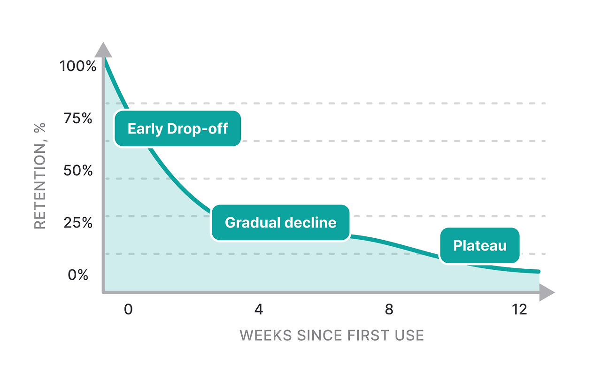
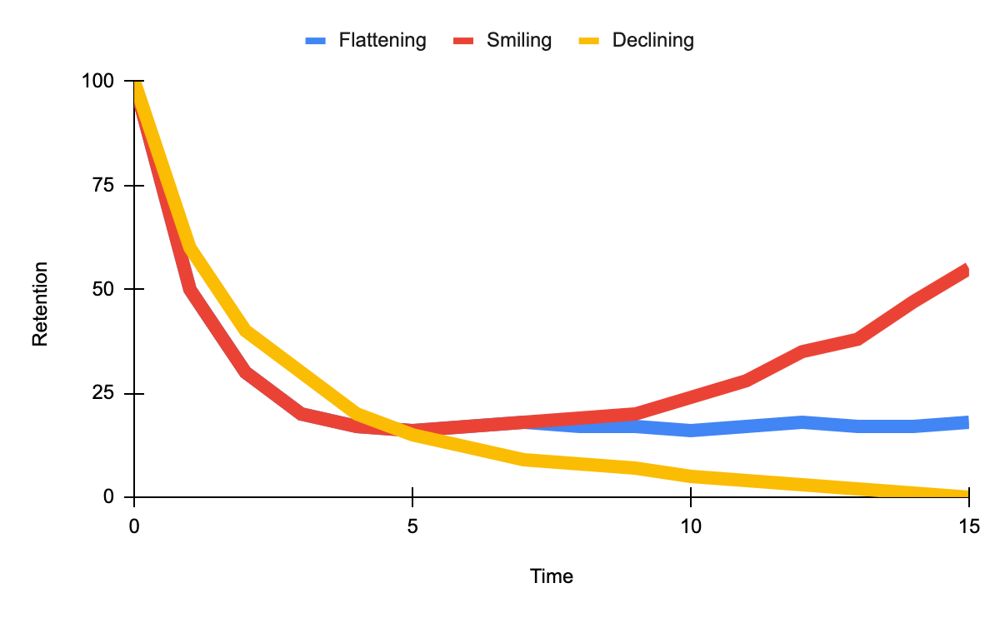
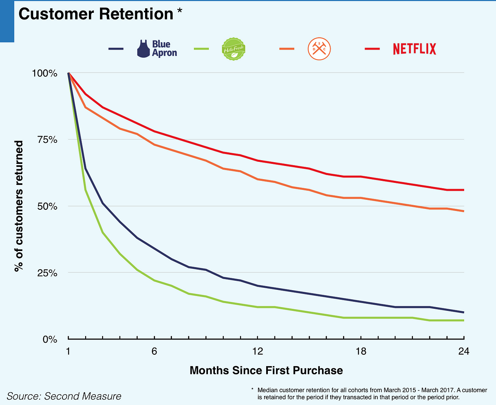

사용자를 얻는 것보다 더 중요한 것은 사용자를 유지하는 것이다. 실리콘밸리의 성공한 스타트업들이 공통적으로 주목하는 '리텐션 커브(Retention Curve)'는 이런 철학에서 탄생했다. 이 프레임워크는 단순히 숫자로만 보이던 사용자 유지율을 시각적인 이야기로 전환한다.

리텐션 커브는 특정 기간(보통 일, 주, 월 단위)에 서비스를 시작한 사용자 집단(코호트)이 시간이 지남에 따라 얼마나 서비스에 남아있는지 보여주는 그래프다. 가로축은 시간(1일, 7일, 30일 등), 세로축은 사용자 잔존율(%)을 나타낸다. 이 커브는 제품의 '건강도'와 성장 가능성을 한눈에 진단할 수 있게 해준다.

리텐션 커브는 대개 세 가지 패턴으로 나타난다. 첫째, '빠른 하락 후 소멸'형은 사용자들이 빠르게 이탈하고 결국 거의 남지 않는 패턴으로, 제품-시장 적합성(PMF)에 실패한 경우다. 둘째, '빠른 하락 후 평탄화'형은 초기 이탈 후 일정 비율의 사용자가 장기간 남는 패턴으로, 핵심 사용자층을 확보한 상태다. 셋째, '완만한 하락 후 평탄화'형은 초기 이탈이 적고 높은 비율의 사용자가 유지되는 패턴으로, 강력한 PMF를 달성한 상태를 의미한다.

슬랙(Slack)은 이 프레임워크를 적극 활용한 기업이다. 그들은 리텐션 커브를 분석해 새로운 팀 멤버가 첫 주에 최소 2,000개의 메시지를 주고받을 때 장기 사용률이 급증한다는 사실을 발견했다. 이를 '아하 모먼트(Aha Moment)'로 정의하고, 이 경험을 강화하는 온보딩 과정을 설계해 사용자 유지율을 크게 개선했다.

넷플릭스도 리텐션 커브를 통해 사용자가 첫 30일 내에 최소 15시간 이상 콘텐츠를 시청할 때 장기 구독자로 전환될 확률이 높다는 사실을 발견했다. 이를 바탕으로 개인화된 추천 알고리즘을 강화하고, 신규 가입자의 빠른 콘텐츠 몰입을 유도하는 전략을 구사했다.

기획자가 리텐션 커브를 실전에 적용하는 방법은 다음과 같다. 먼저, 가입 시기나 유입 경로 등 다양한 기준으로 코호트를 나누고, 각 집단의 리텐션 커브를 그려 비교한다. 커브가 급격히 하락하는 구간에 주목해 온보딩, 첫 경험, 핵심 기능 노출 등의 문제점을 찾아 개선한다.

또한, 여러 코호트의 평균 리텐션 커브를 그려 전체 서비스 건강도를 진단하고, 평탄화되는 구간을 KPI로 삼아 장기 사용자 확보 전략을 수립한다. 특정 행동(예: 첫 구매, 친구 초대 등)과 리텐션 커브의 상관관계를 분석해 장기 잔존율을 높이는 핵심 경험을 강화하는 것도 중요하다.

리텐션 커브는 단순한 수치 이상의 인사이트를 제공한다. 이 커브의 모양은 제품의 미래를 예측하는 결정적 신호다. 스타트업 투자자들이 가장 먼저 보는 지표 중 하나가 리텐션 커브인 이유다. 결국 성장의 핵심은 신규 사용자 확보가 아니라, 기존 사용자의 장기적 충성도에 있기 때문이다.