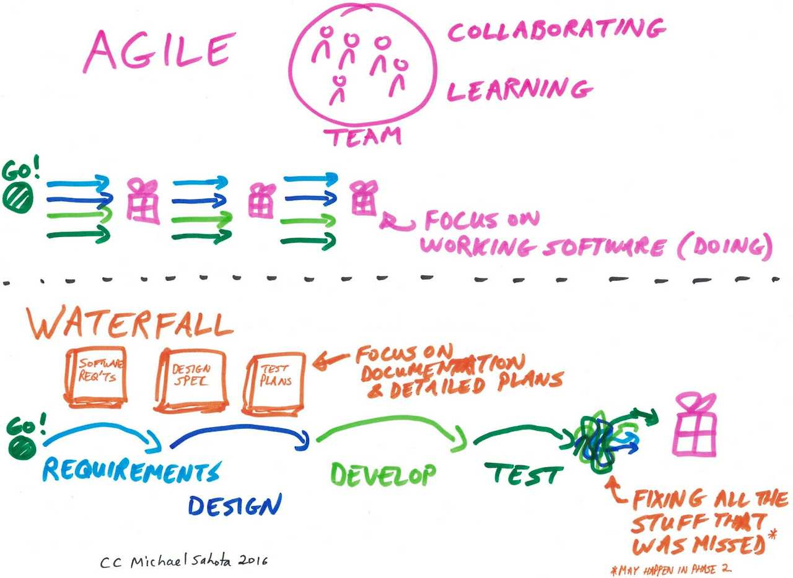
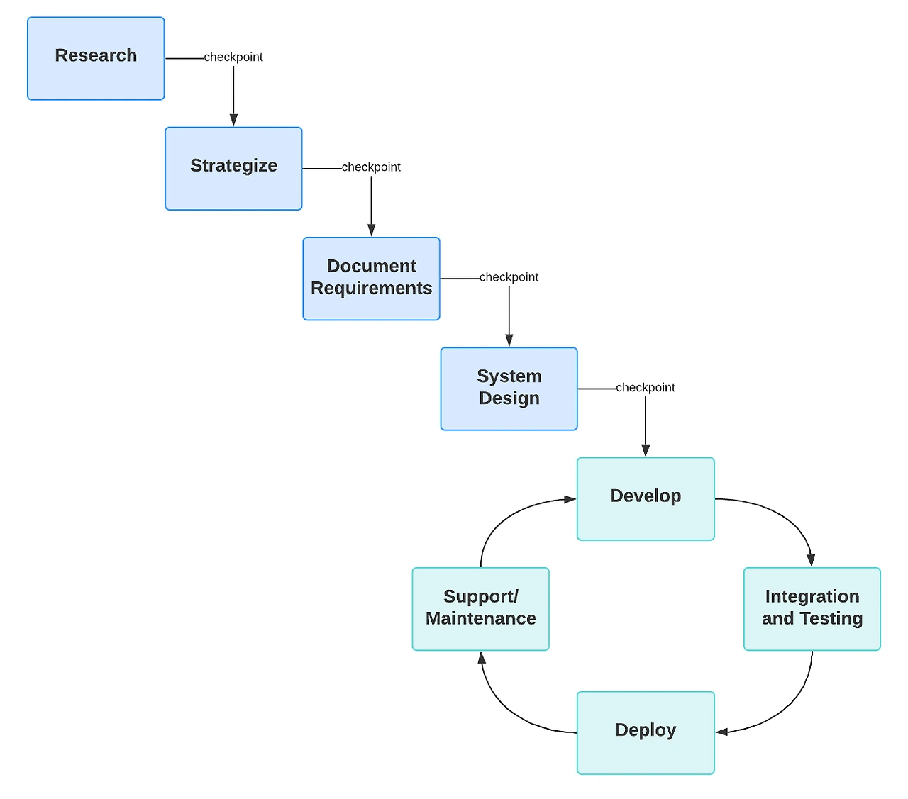

한 IT 회사의 PO(제품 책임자)는 새 프로젝트를 시작하며 고민에 빠졌습니다.

"프로젝트 방법론으로 애자일을 써야 할까, 워터폴을 써야 할까?"

"우리 팀에 더 맞는 건 어떤 방식일까?"

"각 방법의 장단점은 무엇일까?"

폭포수는 요구사항 분석, 설계, 개발, 테스트, 배포의 순차적 단계를 거칩니다. 한 단계가 끝나야 다음으로 넘어가기 때문에 초기에 정한 계획대로 진행되는 경향이 강해요. 대규모 프로젝트에서 예측 가능성이 높다는 장점이 있지만, 요구사항 변경에는 취약할 수 있어요.

반면 애자일은 빠른 변화에 대응하기 위해 짧은 주기의 스프린트를 반복하며 점진적으로 개선해 나가는 방식입니다. 고객 피드백을 수시로 반영하고 우선순위에 따라 유연하게 조정할 수 있죠. 협업과 소통을 중시하기에 작은 팀에서도 효과적이에요. 다만 장기적 계획이나 예산 예측은 상대적으로 어려울 수 있습니다.

어떤 방식을 선택해야 할지는 프로젝트의 특성과 조직 상황에 따라 적합한 방법론이 달라집니다.

**워터폴이 적합한 경우**

요구사항이 명확하고 변경 가능성이 낮은 프로젝트

규제가 엄격한 산업(의료, 금융 등)의 프로젝트

다양한 이해관계자와 부서가 관여하는 복잡한 프로젝트

정확한 비용과 일정 예측이 중요한 경우

**애자일이 적합한 경우**

요구사항이 자주 변경될 수 있는 프로젝트

혁신과 창의성이 중요한 제품 개발

빠른 시장 진입이 중요한 경우

고객 피드백을 지속적으로 반영해야 하는 서비스

**하이브리드 접근법**

많은 성공적인 기업들은 두 방식의 장점을 결합한 하이브리드 접근법을 사용합니다. 글로벌 커머스기업은 초기 계획 단계에서 워터폴 방식으로 큰 그림을 그리고, 실제 개발 과정에서는 애자일 방식을 도입하여 유연성을 확보합니다. 글로벌 전자회사는 하드웨어 개발에는 워터폴을, 소프트웨어 개발에는 애자일을 적용하는 하이브리드 전략을 활용합니다.

**기획자를 위한 실천 팁**

프로젝트 특성 분석하기: 팀 규모, 제품 복잡성, 고객 참여도, 변경 가능성 등을 고려하세요.

팀 역량 파악하기: 팀원들의 경험과 애자일에 대한 이해도가 중요합니다.

점진적 도입 고려하기: 애자일을 처음 도입한다면, 작은 프로젝트부터 시작하는 것이 좋습니다.

지속적인 학습과 개선: 어떤 방법론을 선택하든, 프로젝트를 통해 배운 점을 다음에 적용하세요.

어떤 방법론이 옳고 그르다는 절대적인 기준은 없습니다. 중요한 것은 프로젝트와 팀에 맞는 방식을 선택하고, 필요에 따라 유연하게 조정하는 것입니다. 기획자로서 두 방법론의 장단점을 이해하고 상황에 맞게 적용한다면, 프로젝트의 성공 가능성을 높일 수 있을 것입니다.