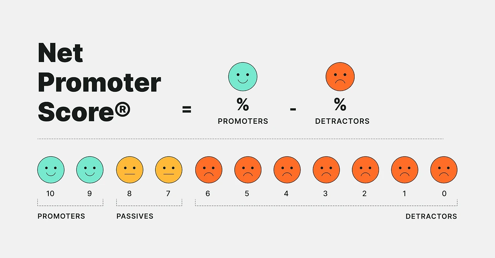

2003년 어느 날, Fred Reichheld는 하나의 의문을 품었다. "기업의 성장을 예측하는 가장 단순한 방법은 무엇일까?" 많은 고민 끝에 그가 찾은 답은 놀라울 정도로 단순했다.

"우리 서비스를 주변에 추천하시겠습니까?"

Reichheld는 복잡한 고객만족도 조사 대신, 추천 의향이라는 단순한 질문으로 기업의 미래를 예측할 수 있다고 확신했다. 하버드 비즈니스 리뷰에 소개된 이 아이디어는 순식간에 글로벌 스탠다드가 되었다. 이후 라이헬트는 더 깊은 연구를 통해 이 NPS(Net Promoters Score)가 기업의 성장률과 밀접한 관계가 있음을 밝혀냈다.

아마존의 NPS는 주변 비교 그룹 대비 높다고 한다. 아마존은 이 숫자를 어떻게 만들었을까?

**1. 모든 직원이 고객의 소리를 듣는다**

- 추천자(Promoters, 9-10점)의 열렬한 지지

- 중립자(Passives, 7-8점)의 관망

- 비방자(Detractors, 0-6점)의 불만

**2. 데이터가 전략이 된다**

- 개인화 추천이 전체 매출의 35% 차지

- 프라임 회원은 일반 고객보다 2.3배 더 구매

- 고객 이탈 징후를 조기에 포착

아마존 외에도 다양한 IT 기업들은 NPS를 적극 활용 중이다. 애플은 NPS로 제품 디자인과 생태계 통합으로 브랜드 팬덤을 강화한다. GE는 NPS를 전사적 KPI로 삼아 고객 중심 경영에 박차를 가하고 있다.

기획자라면 NPS를 어떻게 써먹을 수 있을까?

**1. 맥락을 이해하라**

- "왜 그런 점수를 주셨나요?"

- 숫자 뒤의 이야기를 들어라

**2. 선순환을 만들어라**

- Promoters에게는 더 큰 가치를

- Detractors의 불만은 즉시 해결하라

**3. 지속적으로 측정하라**

- 분기별 트렌드를 파악하라

- 경쟁사와 비교하라

고객을 향한 나의 열정을 0에서 10까지 표현한다면? 얼마일까? 기획자로서, 내가 좋아하는 브랜드처럼 되기 위해 나의 NPS점수를 높여보자.