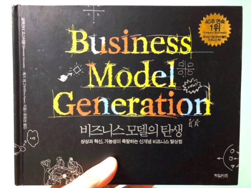
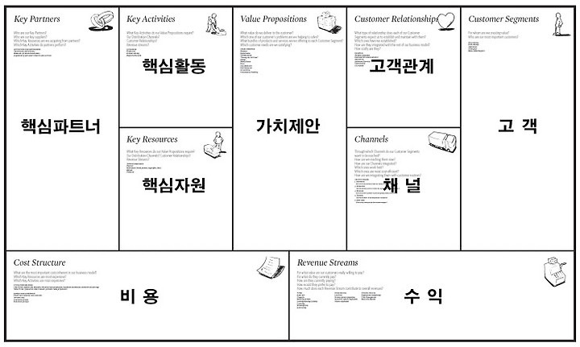
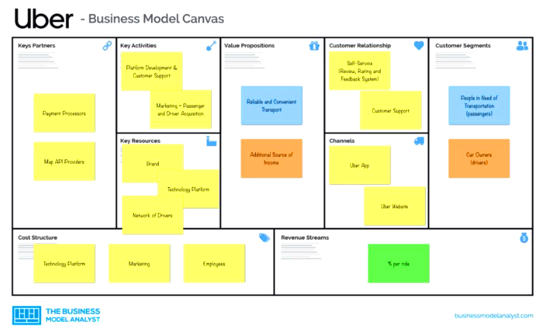

알렉산더 오스터왈더와 이브 피그누어는 박사 논문 작성과 워크숍 진행 중 비즈니스 모델 도출에 도움 되는 책이 없다는 점을 깨달았다. 이에 혁신적인 방식으로 책을 만들기로 결정하게 된다.

오스터왈더와 피그누어는 45개국 470명의 실무자들이 참여하는 개방형 작업 공간을 만들어 '비즈니스 모델의 탄생'이라는 책을 공동 집필 방식했다. 그 과정에서 비즈니스 모델 캔버스(BMC)라는 도구를 개발하게 되었다.

BMC는 한 장의 캔버스에 9개 구성 요소(고객 세그먼트, 가치 제안, 채널, 고객 관계, 수익원, 핵심 자원, 핵심 활동, 핵심 파트너십, 비용 구조)를 배치해 전체 비즈니스 모델을 직관적으로 시각화한다. 이 도구는 비즈니스의 본질에 집중하고, 빠른 반복을 통해 혁신을 가속화하며, 내외부 이해관계자들 간의 소통을 원활히 한다는 점에서 큰 강점이 있다.

BMC는 IT 기업들의 성공 사례를 만드는데 도움을 주었다. 아마존은 BMC를 활용해 자사 고객층을 온라인 쇼핑객과 B2B 구매자로 명확히 구분하고, 이들에게 폭넓은 제품 선택지와 빠른 배송이라는 차별화된 가치를 제안했다. 넷플릭스는 구독형 스트리밍 서비스를 핵심 수익원으로, 빅데이터 기반의 개인화된 콘텐츠 추천을 주요 가치 제안으로 삼았다. 우버는 승객과 운전자를 연결하는 플랫폼을 핵심 자원으로 정의하고, GPS와 자동 결제 시스템 등의 기술력을 바탕으로 편리하고 안전한 모빌리티 서비스를 제공했다.

기획자들은 BMC를 어떻게 활용해야 할까?

비즈니스 목표달성을 위해 고객 니즈에 부합하는 제품과 서비스를 찾는 고객 세그먼트와 가치 제안을 끊임없이 점검해야 한다.

시장 변화와 고객 피드백을 반영해 BMC를 지속적으로 업데이트하는 반복적 개선 노력이 중요하다.

다양한 동료들과 협업해 BMC를 만들어가는 과정 자체가 통합적 시각을 만들 수 있는 귀중한 기회임을 잊지 말아야 한다.

BMC의 각 구성 요소를 가설로 삼아 데이터로 검증해 나가는 자세를 가져야 한다.

BMC는 복잡다단한 비즈니스를 핵심적인 포인트로 정리해주는 강력한 프레임워크로 나의 기획프로세스와 거의 유사해서 추천을 하는 모델이다. 다들 BMC를 활용하여 생생한 고객 인사이트를 바탕으로 한 차별화 된 비즈니스 가치를 창출을 하기 바란다.