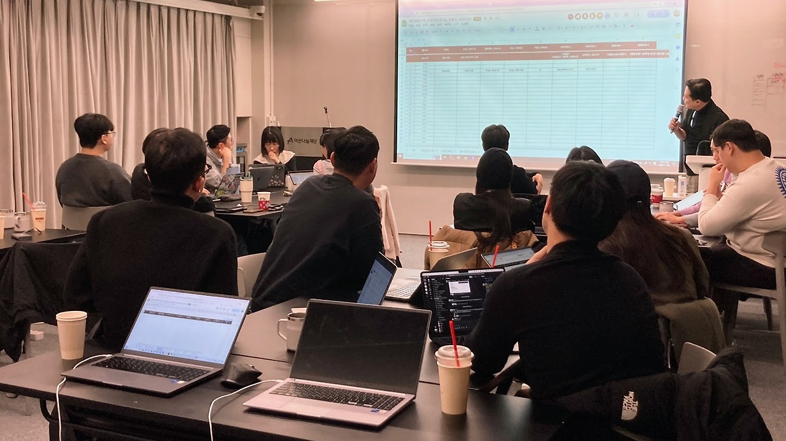
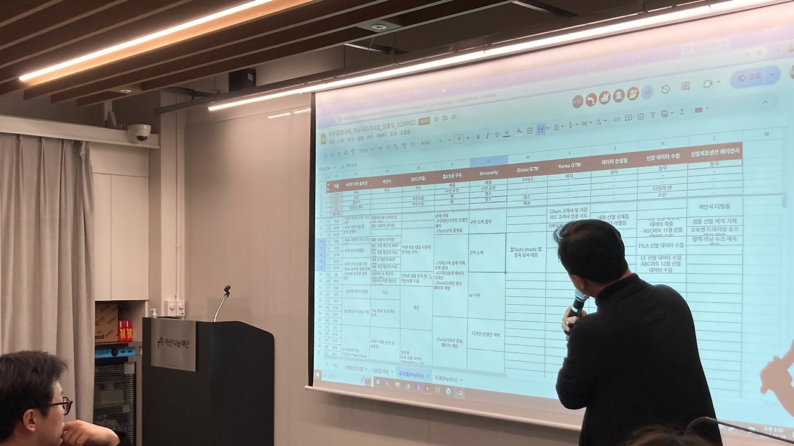
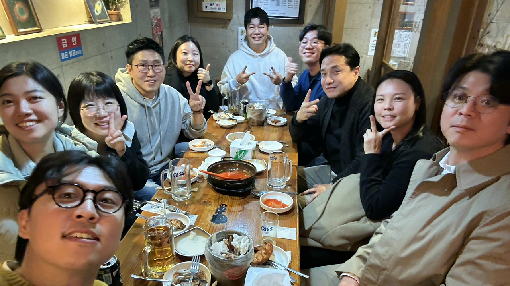

아산나눔재단 프로덕트리더십 워크샵을 성공적으로 마쳤습니다.

초기 스타트업은 PMF를 찾은 후 비즈니스로의 전환은 매우 중요합니다. 이 시기에 가장 많은 시행착오를 겪게되죠. 그러한 시행착오를 줄이면서 성공목표지향적으로 사업을 치밀하게 빌드업하는 것이 Simplifier 의 목표입니다.

비즈니스 모델 - 성공지표 설정 - 로드맵 - 생산조직 구성이 Align되게 하고, 실험과 검증을 하게 함으로써 차츰차츰 목표에 가까워지며 생산속도가 향상됩니다.

스타트업 그로스 코치로써 지난 2년간 검증해 온 방법론을 가지고 아산나눔재단 얼럼나이 스타트업 15개사의 대표 & 프로덕트리더분들과 워크샵을 했습니다.

워크샵 후 또봉이통닭 뒷풀이까지 완벽 그 잡채~!!!

커피챗을 꼭 했으면 좋겠다는 대표님들 덕분에 더 많은 스타트업들이 Simplifier 방법론으로 세상의 혁신을 가속해야겠다고 결심을 하게 되었습니다.

자리를 만들어주신 아산나눔재단에게도 감사드립니다. :-)

