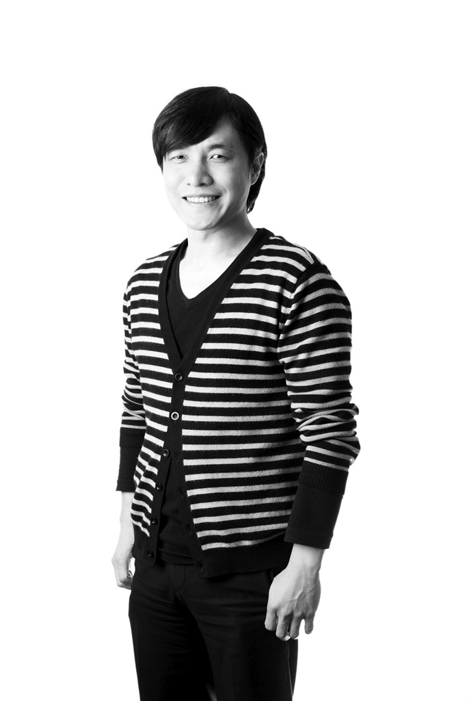

다혈질, 눈치 없음, 안드로메다식 사고, 애매한 정리 및 설명....

제가 생각하는 30대 때의 키워드입니다. 누군가 불합리하게 굴거나 이유없이 갈구면 욱하고, T답게 상대의 감정을 세세하게 배려하지 못하고, 뭔가 기획을 할 때는 이상적인 끝까지 생각을 하고 그러나 그것이 체계화 된 생각으로 정리하거나 설명하지 못하는... 사람이었습니다.

요즘 저를 만나는 사람들에게 이런 얘기를 하면 쉽게 상상이 안된다는 얘기를 하시는 분들이 많습니다.

사실은 저 스스로의 약점들을 알았기에, 매년 우선순위를 가지고 하나씩 하나씩 나아질려고 노력을 해왔습니다. 사람들이 상상이 안된다면 다행히 바뀌긴 바뀌었나 봅니다.

지금도 저는 주기적으로 저의 보다 강화할 점과 개선해야할 점들을 정리하고 트레이닝을 합니다. 이 활동은 생각이 굳어지는 나이가 될 수록 더 열심히 해야한다고 생각합니다. 스스로에게 익숙해지면 꼰대가 되기 딱 좋을 것 같거든요.

하던 대로 살면 편할수도 있을 거에요. 하지만 욕심많은 저에게는 변화되는 저를 통해 더 새로운 일들을 할 수 있고, 새로운 세대들과도 보다 즐겁게 소통을 할 수 있어서 좋습니다.

여러분들의 어린 시절의 키워드는 어떠신가요? :-)

