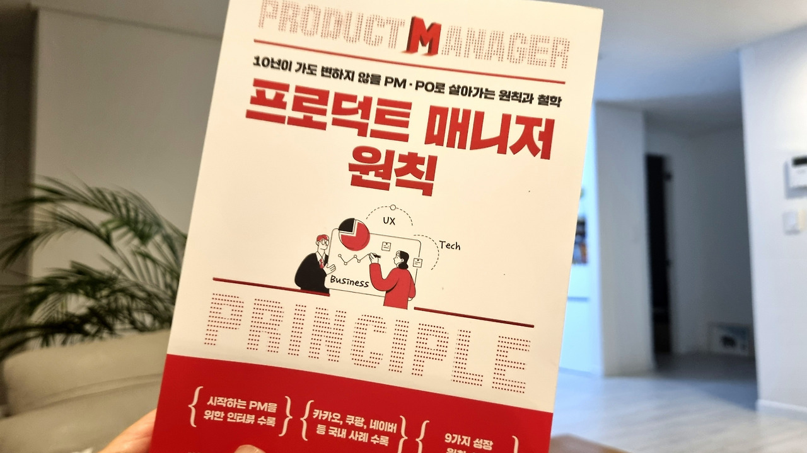
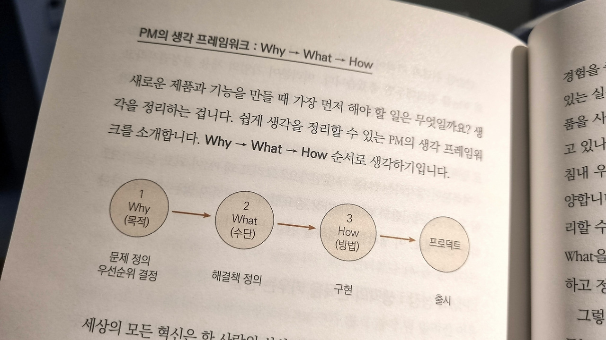
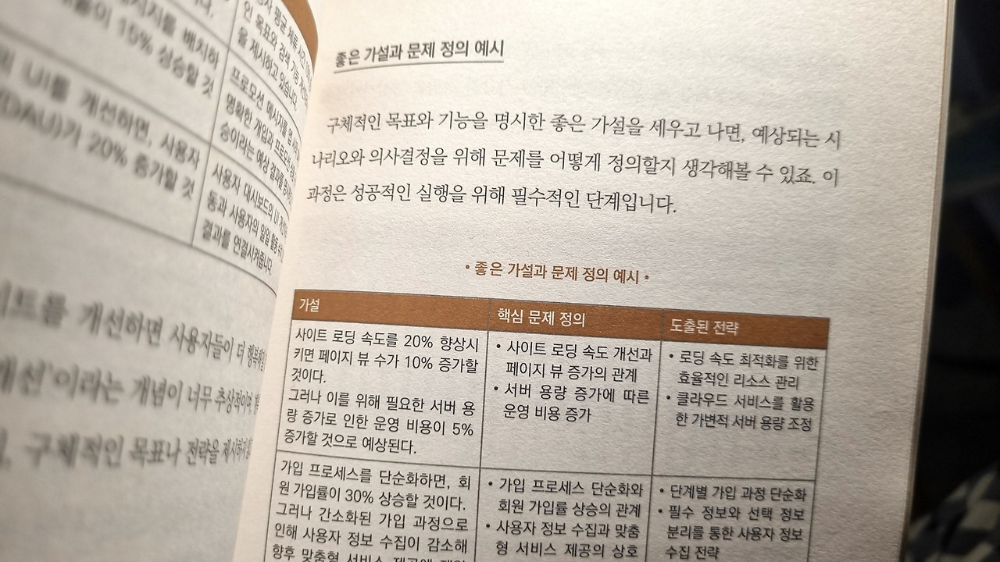

기획은 단순한 계획이나 아이디어가 아니고, 정확한 문제해결 포인트를 찾고, 실행하여, 문제해결을 성공하는 것이 기획입니다. 프로덕트매니저는 담당하는 프로덕트에서 이 일련의 과정을 수행하는 기획자의 한 영역이라고 볼 수 있을 것입니다.

'기획자들의 비밀서재' 시즌2의 3번째 도서는 링친 [Hongseok Jang](https://www.linkedin.com/feed/# "https://www.linkedin.com/feed/#")님과 8분의 PM들이 함께 만든 #프로덕트매니저원칙 이었습니다.

네이버, 카카오, 쿠팡, 엔카, 리멤버, 크몽 등 다양한 메이저 회사를 경험했거나 재직 중인 PM들이 자신들이 기획을 하는 핵심적인 원칙들을 글로 옮긴 책입니다. 북토크 후 반응은 기밀서재 북토크 중 역대급이었습니다. 대표적인 의견 몇 개를 아래 공유합니다.

- 킥오프 미팅을 진행하는 실제 목차와 사례가 있어서 실무에 바로 써볼 수 있어서 꼼꼼히 정리하면서 읽었어요.

- 고객의 문제해결이 중요하다고 모든 PM들이 얘기하고 그것을 풀어나가는 것을 보고 이 것이 기획이구나라고 느꼈어요.

- 기획 입문자로서 제가 그동안 하던 기획활동 대비 이런 다양하고 고차원적인 접근법이 있다는 것을 알고 더 열심히 해야겠구나라고 생각했어요.

기획의 전 과정이 담긴 책은 아니지만, 각 PM이 제시하는 한 가지만 제대로 습득해도 강력하겠다는 생각을 했습니다. 찐 IT 기획자 또는 PM이 되고 싶은 분들에게 추천드리고 싶네요.

저도 이미 아는 영역은 좀 더 체계화하고, 빈 영역은 채워봐야겠습니다. 아래 분들 좋은 책 써주셔서 고맙습니다.

Why”라고 자문하라 - [Hongseok Jang](https://www.linkedin.com/feed/# "https://www.linkedin.com/feed/#") 전) 딜리셔스 공동대표/CPO

의심하고 또 의심하라. 악마도 천사처럼 웃는다 - 강형모 엔카닷컴 프로덕트 오너 리드

더 차이를 만드는 킥오프 기술 - 김수미 전) 무신사, 티켓몬스터 PM

본질적인 문제를 풀어라, 알맞는 방법으로 - 김승욱(CK)\_리멤버 디렉터 오브 프로덕트

'왜 안 되는가'에 집중하라 - 서점직원 프리랜서 프로덕트 기획자

시작하는 PM을 위한 5가지 스킬 - 신필수 OP.GG Ad 스페셜리스트

서비스 뜯어보기 신공 - 이미림 카카오스타일 PO

'프로덕트 떼루아'를 파악하라 - 이상범 에너지엑스 CPO

