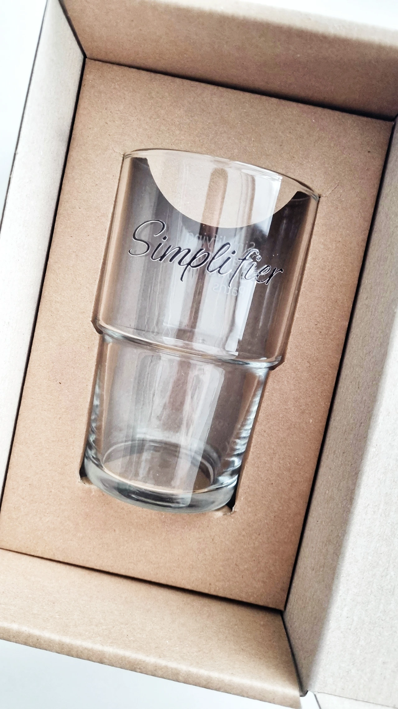
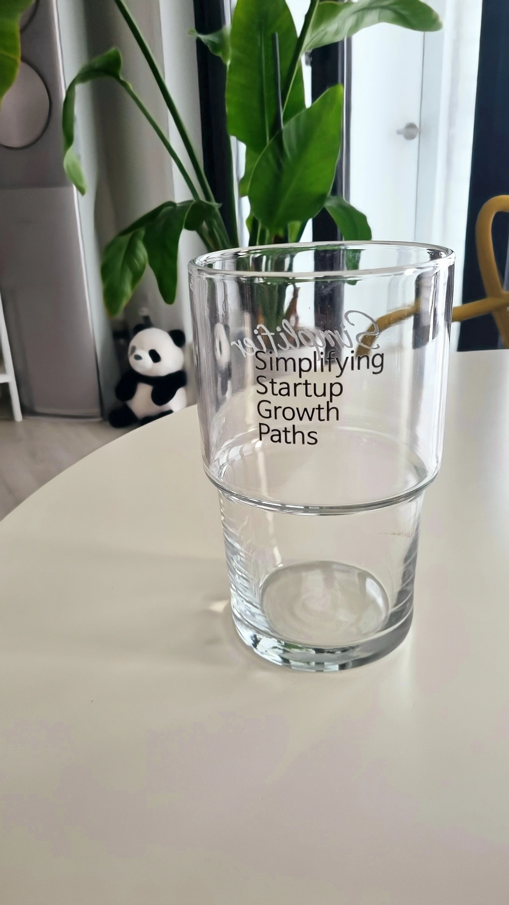
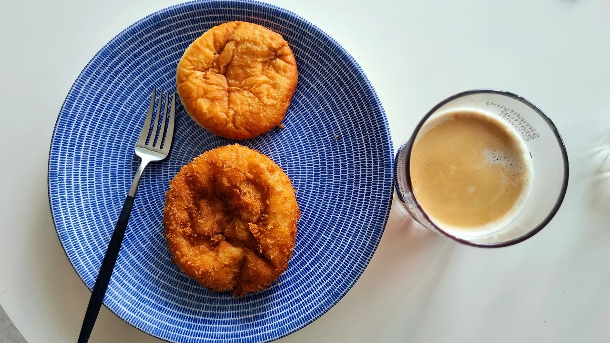

#### 

#### 드디어 심플리파이어 브랜딩 글래스 제작이 완료되었습니다.

#### 

#### 포장을 열자 세련된 자태에 매혹되었습니다. Simplifier 로고와 Simplifying Startup Growth Paths 슬로건이 양각으로 고급스럽게 인쇄되었습니다.

#### 

#### 

#### 심플리파이어 브랜드 GOOD즈는 스타트업 CEO를 위한 레어템으로 디벨롭할 예정입니다.

#### 

#### - 세상을 혁신하는 리더들을 위한 제품

#### - 친환경적이면서 명품처럼 세련된 디자인을 가진 제품

#### - 일상을 좀 더 의미있게 해주는 친구같은 상품

#### 

#### 하나하나 테스팅을 해보면서 가장 브랜드 가치에 가까운 #Simplifier #GOOD즈 를 찾아서 공개하겠습니다.

#### 

#### 

#### 모닝커피를 위한 잔으로도 잘 어울리네요. 모두 즐거운 주말 되시기 바랍니다. :-)

#### 

####