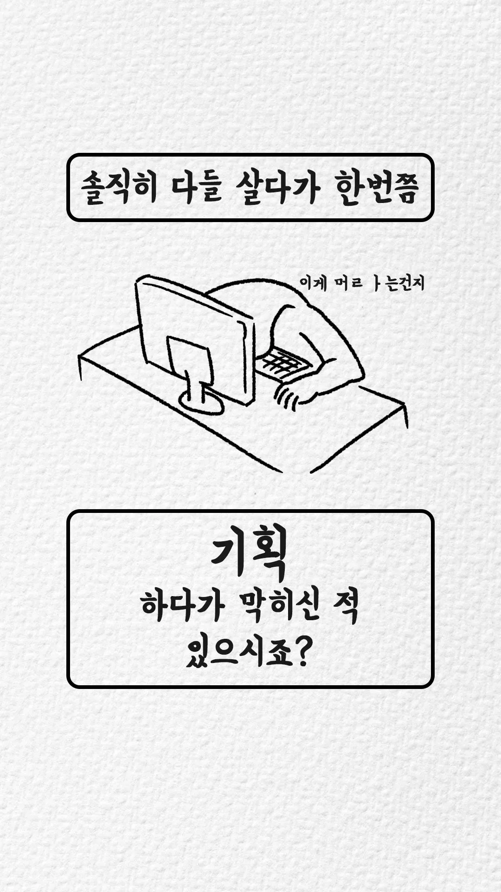
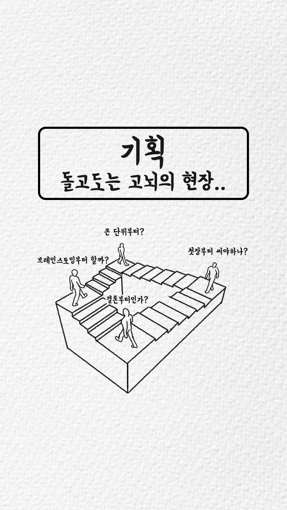
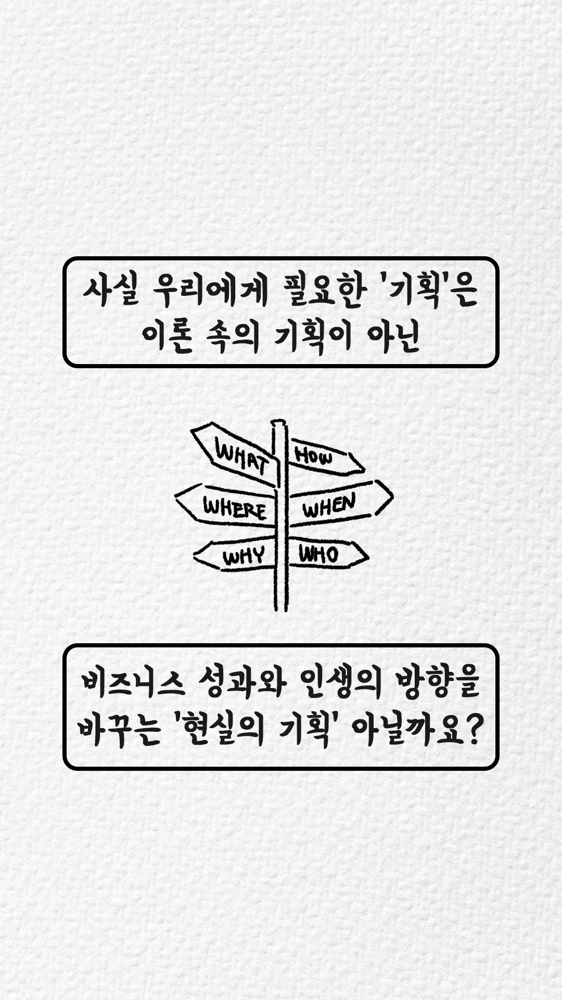
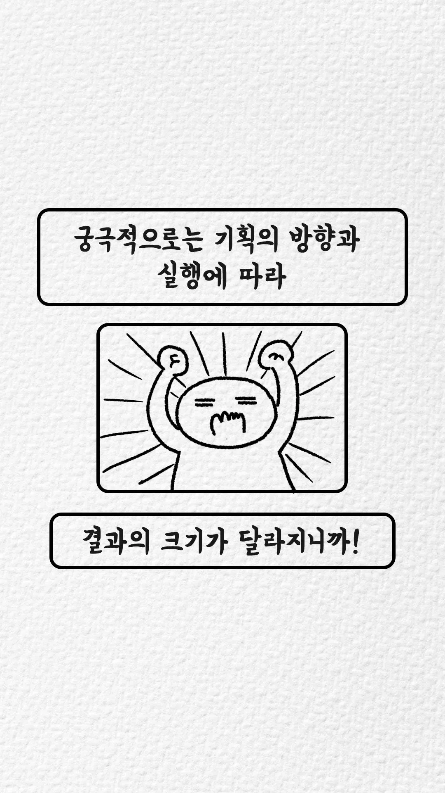
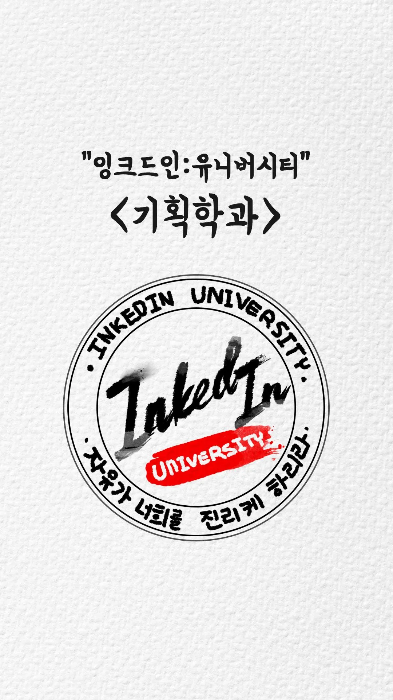

#### 

#### 

[**내가 나를 기획한다면? '기획학과편'**

기획만능주의 | 사회에 나오면 제일 필요한 것이 기획인데, 왜 학교에서는 안 가르쳐줄까요? 사고훈련 커뮤니케이션 & 경청 회의진행(퍼실리테이션) 프레젠테이션 시장 및 고객 리서치 문제정

https://brunch.co.kr/@simplifier/111](https://brunch.co.kr/@simplifier/111 "https://brunch.co.kr/@simplifier/111")

####