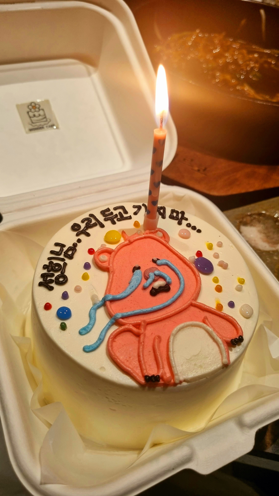
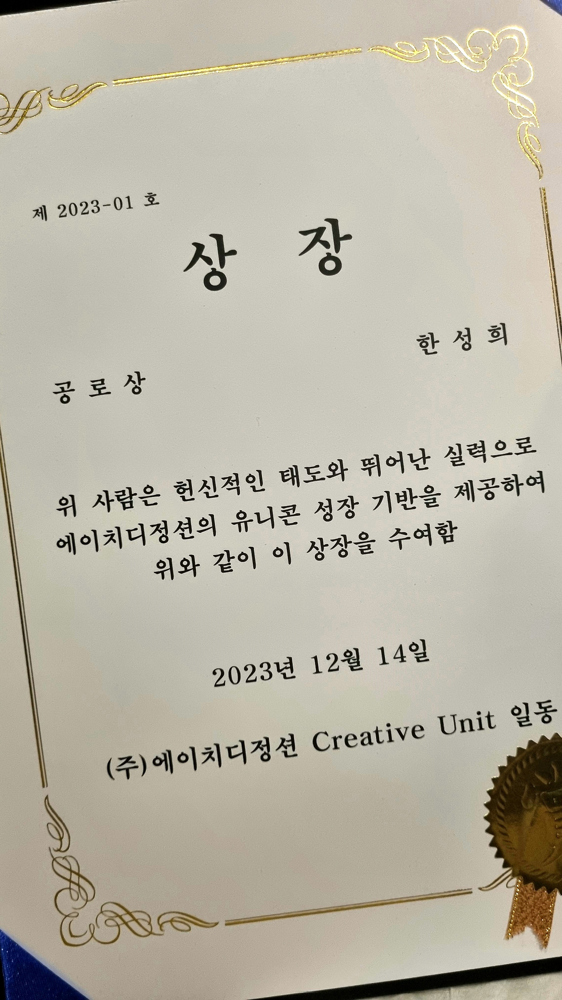
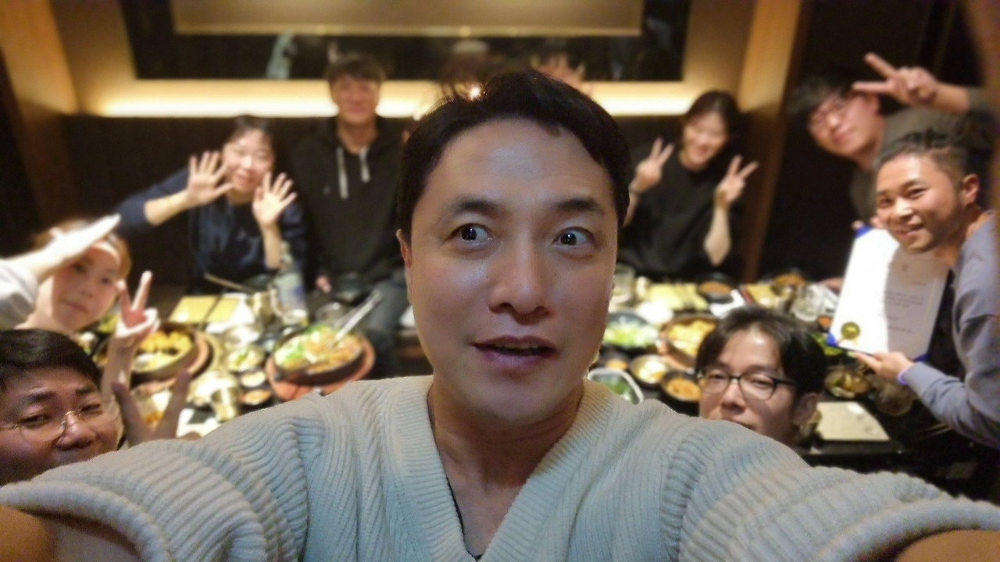

#### 

#### 1.

#### "심플리파이어가 일을 잘하고 있는지, 고객들이 만족하는지 어떻게 판단하세요?" 전 동료의 질문에 저는 바로 대답했습니다.

#### 

#### "계약연장 여부를 봐요. ㅎㅎ"

#### 

#### "심플리파이어는 상호핏 체크를 위해 3개월 계약만 하거든요. 연장하면 서로 만족한 거겠죠."

#### 

#### 2.

#### 그런데 어제부로 새로운 것들이 추가되었습니다.

#### 

#### 저의 첫 고객사인 HD Junction의 PO & UX 조직인 'Creative Unit'과의 송별회가 있었는데요. 예상치 못한 선물을 받았습니다. 초등학교 시절 '착한 어린이상' 이후로 상을 받았던 기억이 가물가물한데 '공로상'과 '제 이름이 적혀있는 케이크' 그리고 밝은 웃음이 가득한 동료들의 모습들 :-)

#### 

#### 3.

#### 올해 초 코칭 사업을 시작할 때만 해도 조금은 막막했었는데요. 일도 사람도 진심으로 꾸준히 대하면 긍정적인 결과가 올 거라는 믿음 하나만 가지고 시작했던 것 같습니다.

#### 

#### 생산체계 개선, 프로덕트의 기본기와 경쟁력 확보 그리고 PO&UX의 역량향상 등등등

#### 

#### 이제 HD Junction 멤버들이 만들고 있는 트루닥 서비스는 정신과 개원의분들이 가장 많이 선택하고 있는 클라우드 EMR 서비스가 되었습니다. 내년에 정신과 외에도 더 많은 고객들에게 선택받기 위한 준비를 하고 있습니다.

#### 

#### 4.

#### 1년이 지난 후 이렇게 웃을 수 있는 상황에 대해 CU(Creative Unit)분들은 저보고 감사하다는데 오히려 제가 감사합니다. 이 결과를 만든 건 그분들이니까요.

#### 

#### 5.

#### 이런 순간과 결과들이 심플리파이어가 프로덕트와 사람을 더욱 진심으로 대해야 하는 이유인 것 같습니다. :-)

#### 

#### 

#### 

####